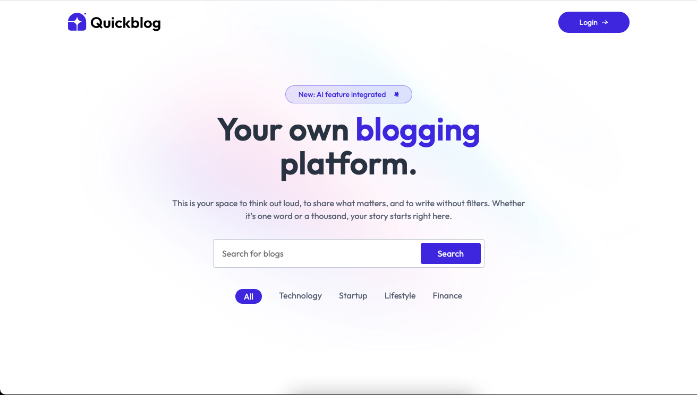

# 📝 QuickBlog — Full Stack Blogging Platform

<div align="center">


**A production-ready full-stack blogging platform built with React, Node.js, Express, MongoDB, ImageKit, and Google Gemini.**

[🐛 Report Bug](https://github.com/singhayush007/QuickBlog-FullStack/issues) · [✨ Request Feature](https://github.com/singhayush007/QuickBlog-FullStack/issues)

</div>

---

## 📸 Screenshot

<div align="center">
  
</div>

---

## 📋 Table of Contents

- [About](#-about)
- [Features](#-features)
- [Tech Stack](#-tech-stack)
- [Folder Structure](#️-folder-structure)
- [Getting Started](#-getting-started)
- [Environment Variables](#-environment-variables)
- [Running the App](#️-running-the-app)
- [Deployment](#️-deployment)
- [Contributing](#-contributing)
- [License](#-license)

---

## 🧠 About

**QuickBlog** is a full-stack blogging platform where an admin can create, manage, and publish blog posts with AI-assisted content generation. Readers can browse published blogs by category, read individual posts, and submit comments for review. Blog images are stored and optimized via ImageKit, data is persisted in MongoDB, and content generation is powered by Google Gemini.

---

## ✨ Features

- 🔐 **Admin Authentication** — Secure JWT-based admin login
- ✍️ **Blog Editor** — Rich text editor (Quill) for writing blog posts with title, subtitle, category, and thumbnail
- 🤖 **AI Content Generation** — Generate blog content from a prompt using Google Gemini
- 🖼️ **Image Upload & Optimization** — Upload blog thumbnails to ImageKit with auto WebP conversion and resizing
- 📂 **Category Filtering** — Filter blogs by category on the public listing page
- 💬 **Comment System** — Readers can submit comments; admin approves or deletes them
- 📊 **Admin Dashboard** — Overview of total blogs, comments, drafts, and recent posts
- 📝 **Draft / Publish Toggle** — Save blogs as drafts or publish them instantly
- 📱 **Responsive Design** — Fully responsive UI built with Tailwind CSS v4
- ☁️ **Vercel Ready** — Both client and server configured for Vercel deployment

---

## 🛠 Tech Stack

| Category | Technology |
|----------|-----------|
| Frontend Framework | React 19 |
| Routing | React Router DOM v7 |
| Rich Text Editor | Quill v2 |
| Markdown Rendering | Marked |
| Backend | Node.js + Express 5 |
| Database | MongoDB + Mongoose |
| Authentication | JWT (jsonwebtoken) |
| AI — Content | Google Gemini (@google/genai) |
| Image Storage | ImageKit |
| File Uploads | Multer |
| Styling | Tailwind CSS v4 |
| Animations | Motion |
| Date Formatting | Moment.js |
| Notifications | React Hot Toast |
| HTTP Client | Axios |
| Build Tool | Vite |
| Deployment | Vercel |

---

## 🗂️ Folder Structure

```
QuickBlog-FullStack/
│
├── client/                          # React frontend (Vite)
│   ├── public/
│   ├── src/
│   │   ├── assets/                  # Images, icons, static assets
│   │   ├── components/              # Reusable UI components
│   │   │   ├── BlogCard.jsx         # Blog preview card
│   │   │   ├── BlogList.jsx         # Blog listing grid with category filter
│   │   │   ├── Footer.jsx           # Site footer
│   │   │   ├── Header.jsx           # Landing page hero/header
│   │   │   ├── Loader.jsx           # Loading spinner
│   │   │   ├── Navbar.jsx           # Top navigation bar
│   │   │   ├── Newsletter.jsx       # Newsletter subscription section
│   │   │   └── admin/
│   │   │       ├── BlogTableItem.jsx    # Blog row in admin table
│   │   │       ├── CommentTableItem.jsx # Comment row in admin table
│   │   │       ├── Login.jsx            # Admin login form
│   │   │       └── Sidebar.jsx          # Admin dashboard sidebar
│   │   ├── context/
│   │   │   └── AppContext.jsx       # Global state (blogs, token, etc.)
│   │   ├── pages/
│   │   │   ├── Home.jsx             # Public homepage
│   │   │   ├── Blog.jsx             # Single blog post page
│   │   │   └── admin/
│   │   │       ├── Layout.jsx       # Admin layout wrapper
│   │   │       ├── Dashboard.jsx    # Admin dashboard overview
│   │   │       ├── AddBlog.jsx      # Create/edit blog post
│   │   │       ├── ListBlog.jsx     # Manage all blog posts
│   │   │       └── Comments.jsx     # Manage comments
│   │   ├── App.jsx                  # Routes definition
│   │   ├── main.jsx                 # App entry point
│   │   └── index.css                # Global styles + Tailwind
│   ├── .env                         # Frontend env vars
│   ├── index.html
│   ├── vite.config.js
│   └── package.json
│
└── server/                          # Node.js + Express backend
    ├── configs/
    │   ├── db.js                    # MongoDB connection
    │   ├── gemini.js                # Google Gemini config
    │   └── imageKit.js              # ImageKit SDK config
    ├── controllers/
    │   ├── blogController.js        # Blog & comment handlers
    │   └── adminController.js       # Admin auth & dashboard handlers
    ├── middleware/
    │   ├── auth.js                  # JWT auth middleware
    │   └── multer.js                # File upload middleware
    ├── models/
    │   ├── Blog.js                  # Blog Mongoose model
    │   └── Comment.js               # Comment Mongoose model
    ├── routes/
    │   ├── blogRoutes.js            # /api/blog/*
    │   └── adminRoutes.js           # /api/admin/*
    ├── server.js                    # Express app entry point
    ├── .env                         # Backend env vars
    ├── vercel.json
    └── package.json
```

---

## 🚀 Getting Started

### Prerequisites

- Node.js 18+
- npm
- A [MongoDB Atlas](https://mongodb.com/atlas) cluster
- An [ImageKit](https://imagekit.io) account
- A [Google AI Studio](https://aistudio.google.com) API key (Gemini)

### 1. Clone the repository

```bash
git clone https://github.com/singhayush007/QuickBlog-FullStack.git
cd QuickBlog-FullStack
```

### 2. Install dependencies

```bash
# Install server dependencies
cd server && npm install

# Install client dependencies
cd ../client && npm install
```

### 3. Configure environment variables

Fill in the `.env` files for both `server/` and `client/` (see [Environment Variables](#-environment-variables) below).

### 4. Run the app

```bash
# Terminal 1 — Backend
cd server && npm run server

# Terminal 2 — Frontend
cd client && npm run dev
```

Open [http://localhost:5173](http://localhost:5173) to view the app.
Admin panel is at [http://localhost:5173/admin](http://localhost:5173/admin).

---

## 🔐 Environment Variables

### `server/.env`

```env
PORT=3001

# JWT Secret
JWT_SECRET=your_jwt_secret

# Admin Credentials
ADMIN_EMAIL=admin@example.com
ADMIN_PASSWORD=yourpassword

# MongoDB
MONGODB_URI=mongodb+srv://<user>:<password>@cluster0.xxxxx.mongodb.net/?appName=Cluster0

# ImageKit
IMAGEKIT_PUBLIC_KEY=your_public_key
IMAGEKIT_PRIVATE_KEY=your_private_key
IMAGEKIT_URL_ENDPOINT=https://ik.imagekit.io/your_id

# Gemini API Key
GEMINI_API_KEY=your_gemini_api_key
```

### `client/.env`

```env
VITE_BASE_URL=http://localhost:3001
```

---

## ▶️ Running the App

```bash
# Development (run in separate terminals)
cd server && npm run server     # Backend on :3001
cd client && npm run dev        # Frontend on :5173

# Production build (client)
cd client && npm run build

# Lint (client)
cd client && npm run lint
```

---

## ☁️ Deployment

Both `client/` and `server/` include a `vercel.json` for Vercel deployment.

1. Push your code to GitHub
2. Create two Vercel projects — one for `client/`, one for `server/`
3. Set the **Root Directory** to `client` or `server` respectively
4. Add all environment variables in each Vercel project's settings
5. Update `VITE_BASE_URL` in the client `.env` to your deployed server URL
6. Vercel auto-deploys on every push to `main`

---

## 🤝 Contributing

Contributions are welcome! Please:

1. Fork the repository
2. Create a feature branch (`git checkout -b feature/amazing-feature`)
3. Commit your changes (`git commit -m 'Add amazing feature'`)
4. Push to the branch (`git push origin feature/amazing-feature`)
5. Open a Pull Request

---

## 📄 License

Distributed under the MIT License. See `LICENSE` for more information.
